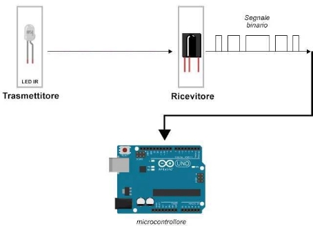
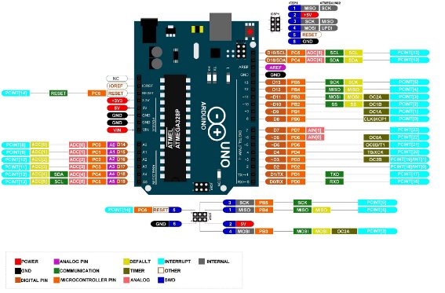
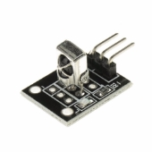

# RICEVITORE TELECOMANDO IR

> ARCHITETTURA DEGLI ELABORATORI [ST1213]
>
> Corso di Laurea in Informatica (Classe L-31)
>
> Ausili Nicolò [115328]

## Indice

1. [Testo assegnato](#testo-assegnato)
2. [Premessa](#premessa)
3. [Funzionamento generico del sistema](#funzionamento-generico-del-sistema)
4. [Analisi del problema](#analisi-del-problema)
    1. [Ragionamento iniziale: utilizzo degli interrupt](#ragionamento-iniziale-utilizzo-degli-interrupt)
    2. [Gli interrupt nell’Arduino UNO](#gli-interrupt-nellarduino-uno)
    3. [Ricevitore e trasmettitore IR](#ricevitore-e-trasmettitore-ir)
    4. [La modulazione](#la-modulazione)
    5. [Il protocollo di codifica](#il-protocollo-di-codifica)
    6. [Il timer nell’Arduino UNO](#il-timer-nellarduino-uno)
    7. [Considerazioni finali](#considerazioni-finali)
5. [Diagrammi di flusso](#diagrammi-di-flusso)
6. [Componenti](#componenti)
7. [Schema circuito](#schema-circuito)
8. [Codice](#codice)
    1. [Dichiarazioni iniziali](#dichiarazioni-iniziali)
    2. [Funzione loop()](#funzione-loop)
    3. [Funzione setup()](#funzione-setup)
    4. [Interrupt Service Routine: ISR(TIMER1_CAPT_vect)](#interrupt-service-routine-isrtimer1captvect)
    5. [Funzione getCommand()](#funzione-getcommand)
9. [Conclusione e problemi rilevati](#conclusione-e-problemi-rilevati)

## Testo assegnato

Realizzare un circuito in grado di riconoscere e visualizzare sulla console seriale, il codice esadecimale associato ai
tasti di un telecomando IR che si ha a disposizione. Come riferimento si consiglia di partire da questo
esempio: [https://wokwi.com/ projects/298934082074575369 ](https://wokwi.com/projects/298934082074575369) e di adattarlo
opportunamente al fine di ottenere un sistema idoneo al proprio telecomando e che RIGOROSAMENTE non utilizzi librerie
specifiche come "IRremote" o simili.

## Premessa

La radiazione infrarossa (IR) in fisica, è la radiazione elettromagnetica con banda di frequenza dello spettro
elettromagnetico inferiore a quella della luce visibile, ma maggiore di quella delle onde radio, ovvero lunghezza d’onda
compresa tra 700 nm e 1 mm (banda infrarossa).

L’infrarosso è utilizzato spesso come mezzo di trasmissione dati: nei telecomandi dei televisori (per evitare
interferenze con le onde radio del segnale televisivo), tra computer portatili e fissi, palmari, telefoni cellulari, nei
sensori di movimento e altri apparecchi elettronici.

Lo standard di trasmissione dati affermato è l’IrDA (Infrared Data Association). Telecomandi e apparecchi IrDA usano
diodi emettitori di radiazione infrarossa (comunemente detti LED infrarossi). La radiazione infrarossa da essi emessa
viene messa a fuoco da lenti di plastica e modulata, cioè accesa e spenta molto rapidamente, per trasportare dati. Il
ricevitore usa un fotodiodo al silicio per convertire la radiazione infrarossa incidente in corrente elettrica. Risponde
solo al segnale pulsante del trasmettitore, ed è capace di filtrare via segnali infrarossi che cambiano più lentamente
come luce in arrivo dal Sole, da altri oggetti caldi, e così via.

## Funzionamento generico del sistema

I telecomandi IR trasmettono i loro comandi inviando una serie di impulsi attraverso un diodo LED a infrarossi.
Il ricevitore IR è dotato di un fotodiodo o un sensore simile che rileva la luce infrarossa trasmessa dal telecomando.  
Il segnale infrarosso è modulato a una frequenza specifica per portare le informazioni del codice inviato.
Il ricevitore demodula il segnale per estrarre il codice trasmesso.
Il codice demodulato viene quindi decodificato dal microprocessore interno del dispositivo, che lo confronta con una
lista di comandi noti.  
Se il codice corrisponde a uno dei comandi noti, il dispositivo eseguirà l’azione associata a quel comando.  
  
*Figura 3.1: Schema logico del funzionamento*

## Analisi del problema

Arduino mette a disposizione diverse librerie in grado di risolvere il problema, ma dal momento che, come citato nel
problema, non è possibile utilizzare librerie specifiche per la cattura del segnale sarà necessario sfruttare altre
tecniche.  
Per riuscire a risolvere il problema ho seguito diverse fasi.

### Ragionamento iniziale: utilizzo degli interrupt

Analizzando di nuovo il problema, comprendo che per rilevare i segnali provenienti dal ricevitore IR, sarà necessario
utilizzare gli interrupt del microcontrollore.  
Il meccanismo è semplice: quando una periferica ha "bisogno di attenzione" da parte del processore, ad esempio quando
deve inviare dei segnali, invia un interrupt. Quando arriva un interrupt, la CPU manda in esecuzione la ISR (Interrupt
Service Routine), ovvero una routine scritta ad hoc per gestire l’interrupt ricevuto.   
Le varie ISR sono contenute nell’Interrupt Vector, o vettore di interruzione, una tabella che associa ciascuna possibile
interruzione con l’indirizzo di memoria dell’ISR corrispondente. Successivamente viene gestito l’interrupt seguendo le
procedure descritte nella ISR e la CPU ritorna al suo normale ciclo di esecuzione.
Per cui la sequenza sarà:

- il ricevitore IR riceve il segnale dal telecomando e invia l’impulso alla scheda;
- la CPU intercetta l’interrupt e cerca nell’apposita tabella degli interrupt vector l’indirizzo di memoria associato al
  tipo specifico di interruzione;
- il processore interrompe temporaneamente l’esecuzione del programma principale e salta all’indirizzo di memoria
  trovato nel vettore di interruzione. Lì, esegue la routine di interrupt associata all’evento. In particolare, essa
  tradurrà il codice ricevuto;
- viene stampato nella seriale e nello schermo LCD il valore ricevuto e il pulsante premuto;
- dopo aver completato la routine di interrupt, il processore riprende l’esecuzione del programma principale dal punto
  in cui è stato interrotto.

Questo ragionamento è descritto con un diagramma di flusso nella Figura 5.1

### Gli interrupt nell’Arduino UNO

Nella fase successiva provo ad applicare il ragionamento logico appena descritto, al kit Arduino in mio possesso in
particolare, avendo a disposizione un Arduino UNO R3, un ricevitore IR, un telecomando IR e vari cavi per la
connessione.  
Non conoscendo il mondo Arduino, ho iniziato studiando il suo funzionamento, il microcontrollore, la differenza tra i
vari pin presenti nella scheda e come utilizzarli. L’Arduino UNO utilizza un ATMega328P, un microcontrollore a chip
singolo della famiglia megaAVR. Dispone di 32 Kbyte di Flash programmabile nel sistema con funzionalità di
Read-While-Write, EEPROM da 1 Kbyte, SRAM da 2 Kbyte, 23 linee  
I/O per uso generale, 32 registri di lavoro per uso generale e opera a una frequenza di circa 20MHz.  
La scheda dispone di 14 pin I/O digitali, 6 pin I/O analogici e diversi pin adibiti all’alimentazione dei componenti che
andranno collegati alla scheda.  
Ciascuno dei pin della scheda Arduino è correlato a una porta. L’ATmega328P ha 3 porti di I/O digitali principali, noti
come PortB, PortC e PortD, ciascuno è controllata da registri di 8 bit; quindi ciascuna porta può controllare 8 pin
digitali di I/O (da 0 a 7).  
Ogni porta ha una propria ISR, che viene eseguita quando viene attivato il flag di interruzione, ovvero dei bit  
contenuti all’interno di un registro (il PCIFR, Pin Change Interrupt Flag Register ) che vengono attivati ogni volta che
avviene una modifica in un pin del gruppo e resettati non appena viene eseguita la ISR.  
I vettori di interruzione corrispondenti per ciascuna di queste porte sono:

- **INT0 (Interrupt 0)**: è collegato al pin 2 dell’Arduino Uno (PD2). Il vettore di interruzione corrispondente per
  INT0 è INT0\_vect (Porta D INT0: External Interrupt Request 0);
- **INT1 (Interrupt 1)**: è collegato al pin 3 dell’Arduino Uno (PD3). Il vettore di interruzione corrispondente per
  INT1 è INT1\_vect (Porta D INT1: External Interrupt Request 1);
- **INT2 (Interrupt 2)**: è collegato al pin 4 dell’Arduino Uno (PB2). Il vettore di interruzione corrispondente per
  PCINT2 è PCINT2\_vect (Porta B PCINT2: Pin Change Interrupt Request 2).

Ad ognuno dei pin digitali è associata un’etichetta diversa denominata PCINT (che sta per interruzione del cambio di
pin), un particolare tipo di interrupt che si attiva solo al verificarsi di un cambiamento di stato del pin (HIGH o
LOW). Le interruzioni PCINT non agiscono su un solo pin, ma sul gruppo di pin gestiti dalla porta su cui vengono
attivati. I PCINT possono essere attivati manualmente tramite codice, modificando i bit dei registri. Con PCINT, se
attivato, ogni volta che un INPUT cambia il suo valore, da HIGH a LOW o da LOW a HIGH, verrà attivata un’interruzione.
> **Breve considerazione**: utilizzando il controllo diretto dei registri per intercettare e gestire gli interrupt
> abbiamo un guadagno di tempo notevole. Secondo un articolo, in cui si simula da una parte l’utilizzo delle
> librerie/funzioni di Arduino e dall’altra la gestione tramite registri, e misurando la velocità dell’impulso tramite un
> oscilloscopio, si nota che, gestendo gli interrupt tramite registri, abbiamo un aumento di velocità di circa 60 volte
> rispetto all’altro metodo.

  
*Figura 4.1: Schema dei pin e porte della scheda Arduino UNO*

### Ricevitore e trasmettitore IR

Il ricevitore in dotazione con il kit è un modulo di ricezione IR KY-022, che opera a una frequenza di 38kHz e può
ricevere segnali IR e trasferirli all’uscita tramite segnale digitale. Esistono diversi protocolli a infrarossi per
inviare i dati. Normalmente la libreria IRremote converte i dati in modo indipendente e dispone di molteplici protocolli
diversi.
\  
*Figura 4.2: Modulo ricezione IR KY-022*

Il pin di uscita (Y) del ricevitore permette di inviare al microcontrollore il segnale ricevuto dal telecomando. A ogni
pulsante del trasmettitore IR è associato un codice univoco, diverso a seconda del tipo di dispositivo di trasmissione
che si sta utilizzando. Nel caso specifico del telecomando ELEGOO in dotazione nel kit, i codici associati ai vari
pulsanti sono presentati nella [tabella 4.1](#tabella4.1)

### La modulazione

La radiazione elettromagnetica IR viene emessa da molte fonti (sole, lampadine, ...). Ciò implica che queste fonti
possono disturbare la comunicazione tra i dispositivi IR comportandosi come dei veri e propri segnali di rumore. Per
evitare che il rumore IR interferisca con il segnale IR dei dispositivi, viene utilizzata una tecnica che prende il nome
di modulazione.  
Quando viene premuto un pulsante viene emessa una sequenza di accensioni e spegnimenti del LED IR a frequenza fissata
secondo uno schema specifico per ogni pulsante premuto. A ogni pulsante è associato uno schema specifico di 0 ed 1.  
Il telecomando emette una serie di impulsi (che si concretizzano in brevissimi flash di luce infrarossa) che vengono
letti e interpretati dal ricevitore. Il trasmettitore invia al ricevitore bytes da 8 bit componendo gli 0 e gli 1
modulando opportunamente gli intervalli di tempo tra un flash e l’altro.

<a name="tabella4.1">Tabella 4.1</a>: Tabella dei codici associati a ogni pulsante  

| Pulsante    | Codice     |  
|-------------|------------|  
| POWER       | 0x00FFA25D |  
| FUNC/STOP   | 0x00FFE21D |  
| VOL+        | 0x00FF629D |  
| FASTBACK    | 0x00FF22DD |  
| PAUSE       | 0x00FF02FD |  
| FASTFORWARD | 0x00FFC23D |  
| DOWN        | 0x00FFE01F |  
| VOL-        | 0x001FEA15 |  
| UP          | 0x00FF906F |  
| EQ          | 0x00FF9867 |  
| ST/REPT     | 0x00FFB04F |  
| 0           | 0x00FF6897 |  
| 1           | 0x00FF30CF |  
| 2           | 0x00FF18E7 |  
| 3           | 0x00FF7A85 |  
| 4           | 0x00FF10EF |  
| 5           | 0x00FF38C7 |  
| 6           | 0x00FF5AA5 |  
| 7           | 0x00FF42BD |  
| 8           | 0x00FF4AB5 |  
| 9           | 0x00FF52AD |  

### Il protocollo di codifica

Il protocollo di codifica, ovvero il protocollo che regola la rappresentazione e la trasmissione dei dati da parte di
dispositivi di trasmissione IR, utilizzato dal telecomando in dotazione nel kit è il protocollo NEC (che, non avendo a
disposizione datasheet del prodotto, ho trovato utilizzando una particolare funzione della libreria IRremote.h), il
quale prevede dei burst di 562,5 µs, a una frequenza portante di 38 kHz (26,3 µs).  
I bit logici vengono trasmessi come segue:

- **0 logico**: un burst di impulsi da 562,5 µs seguito da uno spazio di 562,5 µs, con un tempo di trasmissione totale
  di 1,125 ms;
- **1 logico**: un burst di impulsi da 562,5 µs seguito da uno spazio di 1,6875 ms, con un tempo di trasmissione totale
  di 2,25 ms.

Quando viene premuto un tasto sul telecomando, il messaggio trasmesso è composto, nell’ordine, da quanto segue:

- un burst di impulsi anticipato di 9 ms (16 volte la lunghezza del burst di impulsi utilizzata per un bit di dati  
  logico);
- uno spazio di 4,5 ms;
- l’indirizzo a 8 bit per il dispositivo ricevente;
- l’inverso logico a 8 bit dell’indirizzo;
- il comando a 8 bit;
- l’inverso logico a 8 bit del comando;
- un impulso finale di 562,5 µs segnala la fine della trasmissione del messaggio.

\  
*Figura 4.3: Esempio di frame di messaggio che utilizza il protocollo di trasmissione IR NEC.*

Se si tiene premuto il tasto sul telecomando, verrà emesso un codice ripetuto (in genere circa 40 ms) dopo l’impulso che
indicava la fine del messaggio. Un codice ripetuto continuerà a essere inviato a intervalli di 108 ms, fino al rilascio
definitivo del tasto. Il codice di ripetizione è composto da quanto segue, in ordine:

- un burst di impulso anticipato di 9 ms;
- uno spazio di 2,25 ms;
- un impulso di 562,5 µs scoppia per segnare la fine dello spazio (e quindi la fine del codice ripetuto trasmesso).

  
*Figura 4.4: Esempio di codici di ripetizione inviati per un tasto tenuto premuto sul telecomando trasmittente.*

Ogni volta che si preme un pulsante sul telecomando, viene generato un codice esadecimale univoco, questo sarà il codice
che viene modulato e inviato tramite il segnale IR al ricevitore. Per decifrare quale pulsante è stato premuto sul
telecomando bisognerà fare in modo che il microcontrollore sappia quale codice corrisponde a ciascun tasto sul
telecomando.  
Dunque, per decodificare i codici trasmessi ho bisogno di misurare il tempo tra i cambiamenti di stato del pin in cui è
connesso il ricevitore.

### Il timer nell’Arduino UNO

Arduino UNO ha due tipi di interrupt: gli interrupt hardware (pin change interrupt) e i timer interrupt. Il timer è un
componente hardware che può essere utilizzato per eseguire diverse operazioni temporizzate o per generare segnali di
clock. L’Arduino Uno è dotato di tre timer principali, noti come Timer0, Timer1 e Timer2, ognuno dei quali può essere
configurato per svolgere diverse funzioni di temporizzazione:

- **Timer0**: è spesso utilizzato per generare un clock di sistema per il microcontrollore e per supportare alcune delle
  funzioni di temporizzazione del microcontrollore. Viene anche utilizzato per controllare la temporizzazione delle
  funzioni millis() e micros();
- **Timer1**: è un timer a 16 bit che può essere utilizzato per generare impulsi di larghezza variabile (PWM Pulse Width
  Modulation) su alcuni dei pin digitali dell’Arduino Uno;
- **Timer2**: è un timer a 8 bit che può essere utilizzato per generare PWM su alcuni dei pin digitali dell’Arduino Uno.
  È simile a Timer1 ma ha una risoluzione inferiore.

Ogni timer è alimentato dal clock di sistema, che per il nostro Arduino UNO potrebbe essere il clock da 16 Mhz o a
seconda del bootloader potrebbe anche essere un oscillatore interno da 8 MHz. Tra il timer e il clock di sistema, c’è un
altro componente hardware chiamato prescalare. Questo componente divide il numero di impulsi dell’orologio di sistema
per un numero definito dall’utente che potrebbe essere 8, 64, 256 e così via.  
I timer 0 e 2 sono 8 bit, il che significa che potrebbe contare da 0 a 255. Il timer 1, invece, è a 16 bit, quindi può
contare da 0 a 65546. Una volta che un timer raggiunge il suo valore massimo, tornerà a 0. Quindi in pratica creerebbe
una curva a zig zag. Nel caso dei timer 0 e 2 con registri a 8 bit, quando raggiungono 255, ritorna a 0 e ricomincia.
Questo creerà una curva a forma di triangolo e che può essere utilizzata per creare delle interruzioni.   
Nell’Arduino UNO, il prescalare è settato di default a 64. Questo significa che il Timer1 utilizza un prescalare di 64
per dividere la frequenza di clock del microcontrollore ATmega328P (16 MHz) prima di contarla. Quindi, ci vorranno 4
millisecondi per Timer1 per raggiungere un valore di 1000 con un prescalare di 64 e una frequenza di clock di 16 MHz.
Il valore del timer è memorizzato nel registro TCNT che nel caso del timer 1 è composto da due registri perché è a 16
bit.  
Ogni timer può generare uno o più interrupt. Un tipo di interruzione è la compare match. Si scrive un valore in un
registro diverso e quando il valore del timer è uguale al valore di confronto, attiverà l’interrupt. Ad esempio, se si
imposta il registro delle compare match su 100, ogni volta che il timer 0 raggiunge 100, creerà un’interruzione. Un
altro tipo di interruzione è l’input capture interrupt, implementato sul timer 1. In questo caso il timer memorizza il
suo valore in un registro, ogni volta che si verifica un evento esterno su uno dei pin di Arduino.
> **Breve considerazione**: per il problema assegnato ho bisogno di utilizzare il timer per misurare il tempo tra i  
> cambiamenti di stato del pin in cui è connesso il ricevitore. Considerando la frequenza del clock di 16 MHz ed un  
> valore  
> del prescalare di 1, avrò una frequenza di impulsi di circa uno ogni 62.5 ns. In questo modo il timer conta alla  
> massima velocità possibile. Ciò significa che il timer effettuerà il conteggio a una frequenza molto elevata e  
> acquisirà  
> i dati di input a una risoluzione temporale molto fine.
>
>La frequenza di modulazione del ricevitore IR è di 38 MHz. Il prescalare più adatto alla soluzione è 64 in quanto  
> ottiene una risoluzione leggermente più bassa ma più stabile nelle misurazioni. Inoltre la velocità di campionamento  
> ottenuta risulta essere adeguata all’input del ricevitore IR.

### Considerazioni finali

A questo punto ho tutti gli elementi necessari per risolvere il problema.  
Definisco quale pin utilizzare per collegare il ricevitore IR. Approfondendo meglio, concludo che il pin 8 utilizza il
registro ICR1 come registro di cattura dell’input, ideale per il problema in questione. Dunque, creo un diagramma di
flusso.

## Diagrammi di flusso

\  
_Figura 5.1: Diagramma di flusso iniziale: il flusso delle informazioni con l’utilizzo degli interrupt_  
\  
_Figura 5.2: Diagramma di flusso finale: funzione iniziale, che richiama poi la ISR all’arrivo dell’interrupt._  
\  
_Figura 5.3: Funzione di setup._  
\  
_Figura 5.4: Interrupt Service Routine_  
\  
_Figura 5.5: Funzione getCommand(): decodifica il segnale ricevuto e stampa il codice esadecimale_

## Componenti

Come precedentemente descritto, i componenti utilizzati sono:

- n° 1 scheda Arduino UNO R3 fornito da ELEGOO, che monta un ATMega328P.  
  \
- n°1 ricevitore IR KY-022  
  \
- n°1 trasmettitore IR in dotazione con kit ELEGOO  
  \

## Schema circuito

Il circuito realizzato prevede l’utilizzo di cavi, che non sono stati elencati nell’elenco dei componenti.  
La realizzazione del circuito prevede il collegamento di:

- Ricevitore IR
- G —> "Ground" nella scheda Arduino;
- R —> "+5V" nella scheda Arduino;
- Y —> "8" che corrisponde all’ottavo pin digitale della scheda Arduino
- Scheda Arduino : va connessa a una fonte di corrente tramite il pin di alimentazione o tramite la porta USB.  
  \  
  _Figura 7.1: Circuito fisico finale della soluzione._

## Codice

### Dichiarazioni iniziali

```cpp  
// Memorizza i periodi di tempo ricevuti  
volatile uint16\_t datiCatturati[32];  
// Flag del primo trigger  
volatile uint8\_t primoSegnaleArrivato = 0;  
// Contatore di ricezione  
volatile uint8\_t contatoreRicezione = 0;  
// Flag di ricezione completa  
volatile uint8\_t ricezioneCompletata = 0;  
```  

### Funzione loop()

```cpp  
void loop() {  
	getCommand();
}  
```  

### Funzione setup()

```cpp  
void setup() {  
	// Inizializza la comunicazione seriale per il debug 
	Serial.begin(9600); 
	// Imposta il pin digitale 8 come input 
	DDRB &= ~(1 << DDB0); PORTB |= (1 << PORTB0); 
	// Disabilita tutti gli interrupt finché non sono configurate le impostazioni del Timer 1
	cli(); 
	// Configura il Timer 1 per la cattura dell'input 
	// Imposta TCCR1A a 0 
	TCCR1A = 0x00; 
	// Abilita il trigger su fronte di salita, prescaler a 64 
	TCCR1B = (1 << ICES1) | (1 << CS11) | (1 << CS10); 
	// Imposta TCCR1C a 0 
	TCCR1C = 0x00; 
	// Abilita l'interrupt di cattura dell'input 
	TIMSK1 |= (1 << ICIE1); 
	// Abilita tutti gli interrupt globali 
	sei();
}  
```  

### Interrupt Service Routine: ISR(TIMER1\_CAPT\_vect)

```cpp  
// Il Timer 1 è stato configurato per lavorare in modalità di cattura dell'input  
ISR(TIMER1\_CAPT\_vect) {  
	// La cattura inizia dopo il primo fronte di discesa rilevato dal pin ICP1 
	if (primoSegnaleArrivato) { 
		// Leggi il valore del registro di cattura dell'INPUT 8
		datiCatturati[contatoreRicezione] = ICR1;
		// Se il valore è maggiore di 600 (~2.4ms), allora 
		if (datiCatturati[contatoreRicezione] > 625) {
			contatoreRicezione = 0;
			ricezioneCompletata = 0;
		} else { 
			contatoreRicezione++; 
			// Se tutti i bit sono stati rilevati 
			if (contatoreRicezione == 32) { 
				ricezioneCompletata = 1; 
			} 
		} 
	} else { 
		// Primo fronte di discesa rilevato! Inizia la cattura 22 dal secondo fronte di discesa. 
		primoSegnaleArrivato = 1; 
	} 
	// Resetta il contatore del Timer 1 dopo ogni cattura 
	TCNT1 = 0;
}  
```  

### Funzione getCommand()

```cpp  
uint32\_t getCommand() {  
	// La ricezione è completa, inizia il processo di decodifica 
	if (ricezioneCompletata) { 
		// Memorizza il valore decodificato 
		uint32\_t streamRicevuto = 0; 
		// Decodifica tutti i 32 bit ricevuti come periodi di tempo 7 
		for (int i = 0; i < 32; i++) { 
			// Se il periodo di tempo è compreso tra 1,0 ms e 1,2 ms 9
			if (datiCatturati[i] < 300 && datiCatturati[i] > 250 && i != 31) {  
				// Esegui solo lo shift a sinistra del valore corrente 
				streamRicevuto = (streamRicevuto << 1); 
			}
			// Se il periodo di tempo è compreso tra 2,1 ms e 2,4 ms 15
			else if (datiCatturati[i] < 600 && datiCatturati[i] > 525) {
				// Incrementa il valore di 1 tramite l ' operazione OR logico 
				streamRicevuto |= 0x0001; 
				if (i != 31) { 
					// Esegui solo lo shift del bit a meno che non sia l ' ultimo bit della sequenza catturata 23
					streamRicevuto = (streamRicevuto << 1); 
				} 
				// Imposta ricezioneCompletata a 0 per la prossima cattura
				ricezioneCompletata = 0; 
			} 
		} 
		Serial.print("0x00"); 
		Serial.println(streamRicevuto, HEX); 
		return streamRicevuto; 
	} 
	return 0;
}  
```  

## Conclusione e problemi rilevati

La cattura del segnale attraverso la gestione diretta dei registri e l’utilizzo del timer di Arduino fanno sì che la  
soluzione adottata sia molto più veloce rispetto all’utilizzo di librerie come "IRremote.h".  
La problematica principale, rilevata durante i test, è che, in caso di mancato allineamento tra trasmettitore e  
ricevitore, non viene mostrato lo stesso codice per uno stesso tasto. Questo perché potrebbero esserci nelle vicinanze
dei dispositivi che creano rumore o disturbi al segnale, che provocano delle perdite o delle alterazioni del segnale
stesso causando una ambigua conversione dei valori ricevuti.  
Un’altra problematica di cui non sono ancora riuscito a capire l’origine è che. Confrontando i codici dei vari  
pulsanti nella libreria "IRremote.h" e nei tutorial di Arduino ed Elegoo, risulta che alcuni codici rilevati dalla mia
soluzione siano invertiti.  
Ad esempio:

- Tasto 9 (secondo i codici Elegoo): **0xAD52FF00**
- Tasto 9 (secondo il mio codice): **0x00FF52AD**

Purtroppo, alcuna ricerche non hanno prodotto risultato. I risultati del progetto sono comunque stati raggiunti.

In conclusione, posso dire che questo progetto è stato molto stimolante, sia perché mi ha permesso di imparare a
utilizzare Arduino al meglio e studiarne tutti i funzionamenti, sia perché mi ha permesso di mettere mano a una
progettazione vera e propria di una (chiamiamola così) "libreria personale" in grado di svolgere quasi le stesse
funzioni di una libreria utilizzata normalmente per queste soluzioni.
